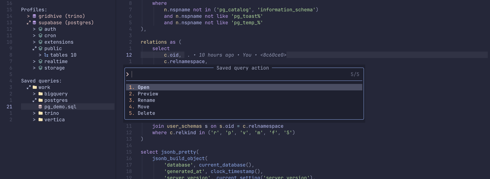
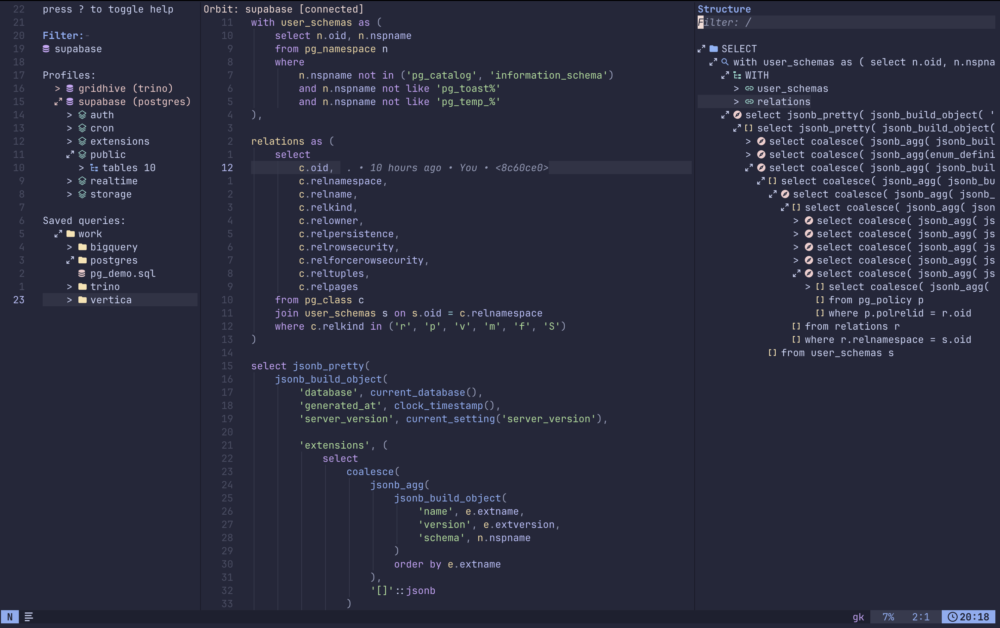

# :rocket: Orbit.nvim

## A database IDE for Neovim

Your database revolves around your editor, not the other way around.

Orbit runs statements through your existing database CLI, retains one connection per profile where the CLI supports it, keeps profiles per query buffer, browses schemas, completes cached objects, and renders normalized results in a navigable grid.


## Contents

- [What It Does](#what-it-does)
- [Requirements](#requirements)
- [Installation](#installation)
- [Quick Start](#quick-start)
- [Connection Profiles](#connection-profiles)
- [Workspace Workflow](#workspace-workflow)
- [Commands](#commands)
- [Keybindings](#keybindings)
- [Completion](#completion)
- [Structure Panel](#structure-panel)
- [Execution And Results](#execution-and-results)
- [Configuration](#configuration)

## What It Does

- Open one dedicated workspace tab with a searchable profile and schema browser.
- Run a whole statement or a visual selection asynchronously without leaving Neovim.
- Bind each query buffer to its own connection profile.
- Browse tables, views, and columns; run connector-specific object actions; create a bound sample statement; copy qualified object names.
- Inspect and copy raw result values, including structured JSON values.
- Confirm potentially mutating statements before they run.
- Complete cached tables, views, columns, and table aliases, clause-aware, through a blink.cmp source.
- Browse reusable SQL files from multiple named saved-query locations.

## Requirements

- Neovim 0.10 or later.
- No required third-party Neovim plugins.
- The CLI required by each connection profile:

| Profile kind | CLI                                                                                                                                                                                               | Notes                                     |
| ------------ | ------------------------------------------------------------------------------------------------------------------------------------------------------------------------------------------------- | ----------------------------------------- |
| `trino`      | [`trino`](https://trino.io/docs/current/client/cli.html)                                                                                                                                          | Orbit requests JSON output.               |
| `sqlite`     | `sqlite3`                                                                                                                                                                                         | Requires a build that supports `-json`.   |
| `postgres`   | [`psql`](https://www.postgresql.org/docs/current/app-psql.html)                                                                                                                                   | Requires a version that supports `--csv`. |
| `mysql`      | Oracle [`mysql`](https://dev.mysql.com/doc/refman/8.4/en/mysql.html) 8.x or MariaDB [`mariadb`](https://mariadb.com/docs/server/clients-and-utilities/mariadb-client/mariadb-command-line-client) | Connects to MySQL 8.x servers using XML.  |
| `vertica`    | [`vsql`](https://docs.vertica.com/24.3.x/en/connecting-to/using-vsql/)                                                                                                                            | Uses HTML table output.                   |

## Installation

With [lazy.nvim](https://github.com/folke/lazy.nvim):

```lua
{
  "mrpbennett/orbit.nvim",
  opts = {},
}
```

Or call setup from your Neovim configuration:

```lua
require("orbit").setup()
```

## Quick Start

1. Run `:OrbitProfiles`. This creates `~/.local/share/orbit.nvim/profiles.json` with owner-only (`0600`) permissions and opens it for editing.
2. Add a connection profile using the format below.
3. Open `:OrbitWorkspace` or a SQL buffer.
4. Bind a profile with `:OrbitProfile`, or press `<CR>` on a profile in the workspace.
5. Run `:OrbitExecute`, or use `<leader>E` in Normal or Visual mode in a SQL buffer.

If a query buffer has no profile, executing it opens profile selection and retries after you choose one.

### Supported Connectors

| Kind       | Required options            | Optional options                                                                                                                | Schema support                                                                                                           |
| ---------- | --------------------------- | ------------------------------------------------------------------------------------------------------------------------------- | ------------------------------------------------------------------------------------------------------------------------ |
| `trino`    | `server`, `user`, `catalog` | `schema`, `schema_patterns`, `executable`, `arguments`, `confirm_mutations`                                                     | Tables, views, and columns from `information_schema`. Omitting `schema` browses the catalog except `information_schema`. |
| `sqlite`   | `path`                      | `schema_patterns`, `executable`, `arguments`, `confirm_mutations`                                                               | Tables and views from `sqlite_master`, plus columns from `PRAGMA table_info`, under `main`.                              |
| `postgres` | `database`                  | `schema_patterns`, `host`, `port`, `user`, `password`, `sslmode`, `executable`, `arguments`, `confirm_mutations`                | Tables and views outside PostgreSQL system schemas, plus columns, primary keys, foreign keys, and indexes.               |
| `mysql`    | `database`                  | `schema_patterns`, `host`, `port`, `socket`, `user`, `client_family`, `sslmode`, `executable`, `arguments`, `confirm_mutations` | MySQL 8.x tables and views, plus columns, primary keys, foreign keys, indexes, and view definitions.                     |
| `vertica`  | `host`, `user`, `database`  | `schema_patterns`, `port`, `password`, `sslmode`, `executable`, `arguments`, `confirm_mutations`                                | User tables and views, plus columns, primary keys, foreign keys, projections, and view definitions.                      |

`executable` replaces the CLI binary and `arguments` adds an array of string arguments before Orbit's generated arguments. This is useful for wrappers or CLI-specific authentication flags. For SQLite, PostgreSQL, MySQL, and Vertica, Orbit retains one interactive CLI connection per profile; statements, schema browsing, and completion prewarming share it and are serialized per profile. A changed profile definition, failed CLI, `:OrbitDisconnect`, or Neovim exit closes the connection; the next request reconnects automatically. Trino statements instead run one `trino` CLI invocation per statement, serialized per profile, because the `trino` CLI does not flush its output while held open on a retained connection.

Schema browsing and completion cache rows only while the connection profile's kind and options are unchanged. Updating a profile clears its prior schema rows before Orbit acquires replacements. Connector metadata that is unavailable for an object, such as Trino primary keys, is shown as unavailable rather than treated as a statement failure. Explicit Workspace refreshes run after pending acquisitions and coalesce with other refresh requests.

`schema_patterns` restricts the tables and views shown by Orbit's Workspace schema browser, but does not change database permissions or restrict statements you run manually. For Trino, it maps each catalog to an array of schema patterns; use an empty array to include every non-system schema from that catalog. PostgreSQL, MySQL, SQLite, and Vertica use a non-empty array instead. Entries accept `*` and `?` globs. A MySQL profile always includes its required default `database`; its patterns add other databases. SQLite's only available schema is `main`.

## Connection Profiles

The profile file is the source of truth for named connection profiles. Its default location is `~/.local/share/orbit.nvim/profiles.json`; set `profile_path` in `setup()` to use another location. Orbit refuses to load a file that is not mode `0600`.

Profiles are JSON, versioned at `1`, and names must be unique:

<details>
<summary>MySQL</summary>

```json
{
  "version": 1,
  "profiles": [
    {
      "name": "app-mysql",
      "kind": "mysql",
      "options": {
        "database": "app",
        "host": "mysql.example.com",
        "port": 3306,
        "user": "alice",
        "sslmode": "verify_identity",
        "arguments": [
          "--login-path=orbit",
          "--ssl-ca=/home/alice/.mysql/ca.pem"
        ]
      }
    }
  ]
}
```

### MySQL Profiles

Use TCP for Docker and remote servers. Use a Unix socket only when Neovim and MySQL can access the same socket file on one machine. MySQL passwords are not connection-profile options; configure them through the selected client's credential file.

#### Oracle MySQL Client

Create a protected login path. This command prompts for the password without placing it in shell history:

```sh
mysql_config_editor set \
  --login-path=orbit \
  --host=mysql.example.com \
  --port=3306 \
  --user=alice \
  --password
```

Then paste the complete MySQL profile shown above into the profile file and replace the example host, database, user, home directory, and CA path. `client_family` and `executable` default to `mysql` and can be omitted.

#### MariaDB Client With Local Docker

The MariaDB client can connect to a MySQL 8.x server but cannot read Oracle MySQL login paths. Create a dedicated owner-only option file instead:

```bash
mkdir -p ~/.local/share/orbit.nvim
read -rsp "MySQL password: " MYSQL_PASSWORD; printf '\n'
umask 077
printf '[client]\npassword=%s\n' "$MYSQL_PASSWORD" \
  > ~/.local/share/orbit.nvim/mysql-docker.cnf
unset MYSQL_PASSWORD
```

Paste this complete profile into the profile file. Replace `/home/you` with the value printed by `printf '%s\n' "$HOME"`:

```json
{
  "version": 1,
  "profiles": [
    {
      "name": "docker-mysql",
      "kind": "mysql",
      "options": {
        "database": "orbit_dev",
        "host": "127.0.0.1",
        "port": 3306,
        "user": "orbit",
        "client_family": "mariadb",
        "executable": "mariadb",
        "arguments": [
          "--defaults-extra-file=/home/you/.local/share/orbit.nvim/mysql-docker.cnf"
        ]
      }
    }
  ]
}
```

Publish the container's MySQL port, for example with `-p 3306:3306`. If Neovim runs in another container on the same Docker network, replace `127.0.0.1` with the MySQL service name. Set `client_family` explicitly even when the MariaDB executable is named `mysql`; executable names do not reliably identify the client family. MariaDB servers are not supported.

#### Unix Socket

Replace `host` and `port` with the socket path in either profile shape:

```json
{
  "database": "app",
  "user": "alice",
  "socket": "/run/mysqld/mysqld.sock"
}
```

Socket profiles cannot set `host`, `port`, or `sslmode`. Mounting a container socket onto the host is possible, but publishing the TCP port is usually simpler.

#### MySQL Connection Scenarios

- **Local Docker:** Publish `3306`, then connect to `127.0.0.1:3306`.
- **Docker-to-Docker:** Put both containers on one network, then use the MySQL service name and port `3306`.
- **Remote MySQL:** Use the server DNS name and port, `sslmode: "verify_identity"`, and a trusted CA. The server firewall and MySQL grants must permit the client address.
- **SSH tunnel:** Run `ssh -L 3307:127.0.0.1:3306 user@remote-host`, then connect to `127.0.0.1:3307`. Because that loopback host normally does not match the server certificate, Oracle MySQL users should use `verify_ca` with a trusted CA, or use a local hostname that resolves to `127.0.0.1` and appears in the certificate. MariaDB clients do not expose an equivalent CA-only mode.

Oracle MySQL clients support `disabled`, `preferred`, `required`, `verify_ca`, and `verify_identity` for `sslmode`. MariaDB clients support `disabled`, `preferred`, and `verify_identity`; other modes fail validation rather than silently changing their security meaning. Pass CA files through `arguments`, as shown in the Oracle profile.
</details>

<details>
<summary>PostgreSQL</summary>

```json
{
  "version": 1,
  "profiles": [
    {
      "name": "app-db",
      "kind": "postgres",
      "options": {
        "database": "postgres",
        "host": "postgres.example.com",
        "port": 5432,
        "user": "postr",
        "password": "somePassword",
        "sslmode": "require"
      }
    }
  ]
}
```

</details>

<details>
<summary>Vertica</summary>

```json
{
  "version": 1,
  "profiles": [
    {
      "name": "warehouse",
      "kind": "vertica",
      "options": {
        "host": "vertica.example.com",
        "port": 5433,
        "database": "warehouse",
        "user": "alice",
        "password": "somePassword",
        "sslmode": "require"
      }
    }
  ]
}
```

</details>

<details>
<summary>SQLite</summary>

```json
{
  "version": 1,
  "profiles": [
    {
      "name": "local",
      "kind": "sqlite",
      "options": {
        "path": "/home/projects/data.db"
      }
    }
  ]
}
```

</details>

<details>
<summary>Trino</summary>

```json
{
  "version": 1,
  "profiles": [
    {
      "name": "analytics",
      "kind": "trino",
      "options": {
        "server": "https://trino.example.com:8443",
        "user": "alice",
        "catalog": "hive",
        "schema": "analytics",
        "arguments": ["--password"],
        "output_format": "CSV_HEADER",
        "schema_patterns": {
          "hive": ["analytics", "reporting"],
          "iceberg": []
        }
      }
    }
  ]
}
```

### Trino Multi-Catalog Schema Browser

Trino profiles still require `catalog` as the CLI's default catalog, but `schema_patterns` can browse schemas from multiple catalogs. Orbit retains each object's catalog for column inspection, copied names, and generated sample statements:

```json
{
  "catalog": "gridhive",
  "schema_patterns": {
    "catalog_1": ["data_v2"],
    "catalog_2": ["aggr", "cleanroom", "report"],
    "iceberg": ["cleanroom"],
    "sqlserver_rep": ["dbo"]
  }
}
```

An empty array, such as `"catalog_1": []`, includes every non-system schema from that catalog. Omit a catalog entirely to hide it.

Trino defaults to `"output_format": "CSV_HEADER"`. This supports every Trino result type, including maps, arrays, rows, and binary values, by displaying the CLI's text representation. CSV represents both SQL `NULL` and an empty string as an empty cell. Set `"output_format": "JSON"` when preserving native scalar values and distinct nulls is more important and statements do not return maps or other complex container types; the stock Trino CLI cannot serialize those values in JSON mode.

Set `output_format` inside the Trino profile's `options` object. Use the default for statements that may return complex values:

```json
{
  "output_format": "CSV_HEADER"
}
```

Switch to JSON for scalar-only results:

```json
{
  "output_format": "JSON"
}
```

Run `:OrbitProfiles`, change the value in the profile's existing `options` object, and save the profile file. The next statement uses the new format. Omitting `output_format` is equivalent to `"CSV_HEADER"`.
</details>

### Authentication

PostgreSQL profiles may include `options.password`. Orbit passes it only to `psql` as `PGPASSWORD`, never as a command-line argument. The profile file is owner-protected (`0600`), but a password remains sensitive; use your system's credential management or a `~/.pgpass` file if you prefer not to store it in JSON.

Vertica profiles may include `options.password`. Orbit passes it only to `vsql` as `VSQL_PASSWORD`, never as a command-line argument.

MySQL profiles do not accept a password. Follow [MySQL Profiles](#mysql-profiles) to configure an Oracle MySQL login path or a protected MariaDB option file.

Configure Trino authentication exactly as you do for the Trino CLI, including its `--password` flag, environment variables, tokens, keyrings, or credential providers it uses.

Orbit passes profile values to the CLI as literal arguments. It does **not** expand `$VAR` or `${VAR}` inside JSON. Other Trino CLI authentication mechanisms, such as tokens or external credential providers, continue to work through their normal CLI configuration.

> [!NOTE]
> Connection profiles can contain sensitive settings, including PostgreSQL passwords. Orbit requires the profile file to be mode `0600`; do not copy it into a repository or share it.

## Workspace Workflow

`:OrbitWorkspace` opens a dedicated Orbit tabpage with a profile/schema browser and a normal SQL editing window. Run it again to toggle that browser. `:OrbitWorkspaceClose` closes only that tabpage.

1. Press `<CR>` on a profile to select it and bind it to the active query buffer.
2. Optionally press `l` to load its schema for browsing and completion.
3. Press `n` to open a new SQL buffer already bound to the selected profile.
4. Execute a statement. Results appear in the reusable bottom result grid.

Schema browser labels normally retain their familiar dotted form. If distinct catalog/schema combinations would display the same label, Orbit quotes their segments to distinguish them, for example `"a.b"."c"` versus `"a"."b.c"`. These labels stay stable while filtering, and each group's expansion and metadata state remain independent. Copied qualified names and SQL completion formatting are unchanged.

Set `saved_query_dirs` to add ordered, named recursive trees of `.sql` files to the sidebar:

```lua
saved_query_dirs = {
  { Work = "~/queries/work" },
  { Personal = "~/queries/personal" },
}
```

Each entry must contain one unique display name and directory. Orbit preserves the configured order, expands paths such as `~`, and shows each location as a separate top-level tree collapsed by default. Select a profile, then press `<CR>` on a saved query to open it in the Workspace query window bound to that profile; loading the schema is not required. Press `r` on any saved-query directory to rescan only its top-level location.

Run `:OrbitSave` from a Workspace query buffer to save it into a configured location. Orbit lets you choose from the available locations and their existing subdirectories, prompts for a filename, and adds `.sql` when needed. Existing files require confirmation. After saving, the current buffer becomes the saved file, so later `:w` writes it normally, and the Workspace reveals it in the saved-query tree.

Press `a` on a saved query to open, preview, rename, move, or delete it. Rename and Move refuse to overwrite an existing file and keep an open query buffer attached to its new path, including unsaved edits. Move can target any existing directory under a configured saved query location. Delete requires confirmation and preserves an open query as an unnamed buffer so its contents are not lost.

From a workspace query buffer, `/` focuses the workspace filter. Elsewhere, `/` retains normal Neovim search behavior.

## Commands

| Command                | Description                                                     |
| ---------------------- | --------------------------------------------------------------- |
| `:OrbitProfiles`       | Create, protect, and edit the profile file.                     |
| `:OrbitProfile`        | Search profiles and bind one to the current query buffer.       |
| `:OrbitSelectProfile`  | Alias for `:OrbitProfile`.                                      |
| `:OrbitExecute`        | Execute the single unambiguous statement in the current buffer. |
| `:'<,'>OrbitExecute`   | Execute the selected line range.                                |
| `:OrbitCancel`         | Cancel the statement running in the current buffer.             |
| `:OrbitDisconnect`     | Close the connection for the current buffer's profile.          |
| `:OrbitStructure`      | Toggle the current query buffer's Structure panel.              |
| `:OrbitSave`           | Save a Workspace query buffer into a saved query location.      |
| `:OrbitWorkspace`      | Open the workspace or toggle its profile/schema browser.        |
| `:OrbitWorkspaceClose` | Close the Orbit workspace tabpage.                              |

Whole-buffer execution rejects ambiguous multi-statement content. Select the exact statement in Visual mode, then run `:OrbitExecute` or `<leader>E`.

## Keybindings

### Configurable Mappings

Orbit installs the following defaults:

| Mode and scope          | Default     | Action                                                   |
| ----------------------- | ----------- | -------------------------------------------------------- |
| Normal, global          | `<leader>D` | Open the workspace or toggle its profile/schema browser. |
| Normal, SQL buffer      | `<leader>E` | Execute the buffer statement.                            |
| Visual, SQL buffer      | `<leader>E` | Execute the visual selection.                            |
| Normal, Structure panel | `<leader>E` | Execute the highlighted Structure element.               |
| Normal, SQL buffer      | `<leader>P` | Select a connection profile.                             |
| Normal, SQL buffer      | `<leader>X` | Cancel the running statement.                            |
| Normal, SQL buffer      | Disabled    | Toggle the Structure panel (`structure = false`).        |

Configure action mappings through `keymaps`. `execute` also applies in the Structure panel; `cancel`, `select_profile`, and the disabled-by-default `structure` action are buffer-local in SQL buffers, while `workspace` is global. Set an action to `false` to disable it.

```lua
require("orbit").setup({
  keymaps = {
    execute = "<leader>E",
    workspace = "<leader>D",
    select_profile = "<leader>P",
    cancel = "<leader>X",
    structure = false,
  },
})
```

### Workspace Sidebar

| Key             | Action                                                                                                      |
| --------------- | ----------------------------------------------------------------------------------------------------------- |
| `l`             | Expand the selected profile, schema, object group, table metadata folder, or object.                        |
| `h`             | Collapse the selected node.                                                                                 |
| `<CR>`          | Select and bind a profile to the current query buffer, or open a saved query bound to the selected profile. |
| `n`             | Create a query buffer bound to the selected profile.                                                        |
| `s`             | Open a bound sample statement for the selected table or view.                                               |
| `a`             | Select an action for the selected table, view, or saved query.                                              |
| `y`             | Copy the qualified selected table or view name.                                                             |
| `P`             | Preview the selected saved query without opening or binding it.                                             |
| `/`             | Focus the filter from the sidebar or a Workspace query buffer.                                              |
| `r`             | Reload the profile file and refresh the selected profile schema, or rescan saved queries.                   |
| `Z`             | Collapse the open profile schema tree.                                                                      |
| `<2-LeftMouse>` | Activate the clicked node; expandable nodes toggle, profiles bind, and saved queries open.                  |
| `?`             | Show help.                                                                                                  |
| `q`             | Close the workspace.                                                                                        |

While editing the Workspace filter, press `<Esc>` to finish filtering. In a saved-query preview, `q` or `<Esc>` closes the preview. In Workspace help, `q`, `?`, or `<Esc>` closes the help window.

Expanding a table reveals its available metadata folders. SQLite, PostgreSQL, and MySQL provide columns, primary keys, foreign keys, and indexes; Vertica provides columns, primary keys, foreign keys, and projections. Each folder loads on demand. Views remain under the schema's `views` group and expose their columns.

### Saved Queries



Saved queries are `.sql` files kept in named directories that appear as their own section in the Workspace sidebar. Configure one or more via `saved_query_dirs`:

```lua
require("orbit").setup({
  saved_query_dirs = {
    { Personal = "~/sql/personal" },
    { Team = "~/projects/app/sql" },
  },
})
```

To add a query, run `:OrbitSave` from a Workspace query buffer. It prompts for a destination directory (when more than one is configured) and a filename, then writes the buffer's contents there.

In the sidebar, pressing `<CR>` on a saved query opens it bound to its profile, and pressing `a` on a saved query brings up an action menu:

| Action  | Effect                                         |
| ------- | ---------------------------------------------- |
| Open    | Open the query bound to its profile.           |
| Preview | Show the query's contents without opening it.  |
| Rename  | Rename the file in place.                      |
| Move    | Move the file to another configured directory. |
| Delete  | Remove the file after confirmation.            |

Pressing `P` previews a saved query directly, without going through the menu. Pressing `r` rescans all configured directories, picking up files added or removed outside of Neovim.

### Structure Panel



`:OrbitStructure` opens a fixed-width panel at the far-right edge of the current tabpage and focuses it. Running the command again closes the panel. The panel works in ordinary SQL tabs and in the Orbit Workspace, follows the active query buffer, and updates as statements are edited.

By default, statements are grouped under expanded `DDL`, `DML`, `SELECT`, and `Other` headings and sorted alphabetically within each group. Each row keeps its expand/collapse marker and adds a semantic icon distinguishing category groups, statement categories, `WITH` containers, CTEs, query blocks, and clauses. Statement parents start collapsed. A leading `WITH` clause expands into its named CTEs, and each CTE owns one query block per top-level `UNION`, `INTERSECT`, or `EXCEPT` branch. Query blocks expose their `SELECT`, `FROM`, `WHERE`, `GROUP BY`, `HAVING`, `WINDOW`, `ORDER BY`, `LIMIT`, and `OFFSET` clauses. Parenthesized `SELECT` and `WITH` blocks recurse beneath their owning clause, while ordinary function calls and grouped expressions remain inline. The outer query block appears beside the `WITH` container. Orbit ignores comments in labels and highlights the deepest visible element containing the query-buffer cursor.

| Key         | Action                                                                          |
| ----------- | ------------------------------------------------------------------------------- |
| `h`         | Collapse the selected node, or move to its parent.                              |
| `l`         | Expand the selected node, or move to its first child.                           |
| `j`, `k`    | Move through visible tree nodes.                                                |
| `zh`, `zl`  | Scroll horizontally through a complete SQL label.                               |
| `<leader>E` | Execute the highlighted element using the configured `keymaps.execute` mapping. |
| `<CR>`      | Return to the query buffer and navigate to the selected element.                |
| `/`         | Filter statement labels using case-insensitive substring matching.              |
| `<Esc>`     | Clear the filter, or close the panel when no filter is active.                  |
| `q`         | Close the panel and return to the query buffer.                                 |

Executing a statement, query block, or `SELECT` clause uses that element's exact source range. Other rows execute their containing top-level statement. Extracted query blocks and clauses are not guaranteed to be independently valid, so connector errors are shown through the normal diagnostic split.

Structure parsing is dependency-free and tolerant of incomplete SQL. It outlines reliably bounded query blocks and clauses rather than guessing at every SQL expression. Labels retain their complete normalized SQL even when they exceed `structure_width`; the panel remains fixed-width with wrapping disabled. PostgreSQL dollar-quoted bodies and SQLite trigger bodies are kept together; other dialect-specific procedural constructs may appear as best-effort entries.

### Result Grid

| Key                | Action                                                                   |
| ------------------ | ------------------------------------------------------------------------ |
| `h`, `j`, `k`, `l` | Move between cells.                                                      |
| `<CR>`             | Inspect a read-only value, or edit the focused cell in an editable grid. |
| `y`                | Copy the raw selected value.                                             |
| `q`                | Close the standalone grid, or return to the query editor in a Workspace. |

Workspace sample statements for MySQL, PostgreSQL, and SQLite base tables become editable when Orbit can load a primary key. Ad-hoc statements, views, Trino, Vertica, and tables without a primary key remain read-only.

| Key / command       | Action                                                                     |
| ------------------- | -------------------------------------------------------------------------- |
| `o`, `O`            | Insert a local row below or above the current row.                         |
| `i`, `<CR>`         | Enter Insert mode in the focused cell; press `Esc` to keep the local edit. |
| `dd`                | Mark the current row for local deletion.                                   |
| `V`, `j` / `k`, `d` | Select complete rows and delete the selection.                             |
| `<Esc>`             | Clear the current row selection.                                           |
| `u`                 | Undo the most recent local edit.                                           |
| `gg`, `G`           | Move to the first or last result row while retaining the focused column.   |
| `:w`                | Confirm, transactionally save, and reload pending changes.                 |
| `:wq`               | Save successfully, then close the Result grid.                             |
| `:q!`               | Discard local changes and close.                                           |
| `:e!`               | Discard local changes and reload the table.                                |

Edits are never sent to the database until `:w`. A failed write leaves the local Result grid unchanged.
Type `NULL` as the complete cell value to write a SQL `NULL` value.

Normal Neovim scrolling remains available, including `<C-d>`, `<C-u>`, `zh`, and `zl`.

In the raw-value inspector, `y` copies the complete value and `q` closes the window.

### Diagnostic Window

Database and execution errors may open in a diagnostic split. Press `q` there to close it.

### Schema Object Actions

Press `a` on a table or view in the Workspace schema browser to select an action supplied by its connection profile kind. Actions that inspect metadata open in the Result grid; sample actions create a bound query buffer instead.

- SQLite: sample statement, columns, primary keys, indexes, foreign keys, and object definition.
- PostgreSQL: sample statement, columns, primary keys, indexes, foreign keys, and view definition.
- MySQL: sample statement, columns, primary keys, indexes, foreign keys, and view definition.
- Vertica: sample statement, columns, primary keys, foreign keys, projections, and view definition.
- Trino: sample statement and columns.

Available actions are intentionally connector-specific. Orbit does not present metadata actions that the selected CLI or database cannot support reliably.

## Completion

Orbit's schema-aware completion (tables, views, columns, table aliases) is provided entirely through a [blink.cmp](https://github.com/Saghen/blink.cmp) source — there is no native/omnifunc fallback, so blink.cmp is required to get any Orbit completion suggestions. blink.cmp has no API for a plugin to register itself as a source at runtime, so add it to your own blink.cmp config:

```lua
{
  "saghen/blink.cmp",
  opts = {
    sources = {
      default = { "lsp", "path", "snippets", "buffer", "orbit" },
      providers = {
        orbit = { name = "orbit", module = "orbit.blink" },
      },
    },
  },
}
```

Once wired up, suggestions appear automatically as you type, no manual trigger needed. Completion is clause-aware: it parses the statement around your cursor (not just the current line) with a small dependency-free SQL tokenizer, so suggestions depend on where you are:

- Tables and views after any `FROM`-family clause (`FROM`, `JOIN`, `UPDATE`, `INTO`), and after database/schema/catalog qualifiers on connectors that support them (MySQL, PostgreSQL, Trino).
- Trino catalogs configured as top-level `schema_patterns` keys are offered alongside direct relation suggestions. Selecting a catalog and schema completes progressively (`catalog.` → `catalog.schema.` → `catalog.schema.table`); without `schema_patterns`, only the profile's default `catalog` is offered.
- Columns in the `SELECT` list, `WHERE`, `ON`, `GROUP BY`, `ORDER BY`, `INSERT INTO t (...)`, and `UPDATE t SET ...`.
- Table aliases: `SELECT u.| FROM users u` resolves `u` to `users`'s columns, including old-style comma joins (`FROM a, b`). With more than one table in scope, unqualified columns are offered from every table, each annotated with its source alias.
- The alias/table scope is limited to the statement your cursor is in; other statements in the same buffer (separated by `;`) never leak into it. CTEs and derived tables (`FROM (SELECT ...) sub`) are recognized so they don't break parsing, but don't offer column completion.
- Suggestions are narrowed to whatever you've already typed (case-insensitive prefix match) before being handed to blink.cmp, so its own fuzzy scoring only ever sees genuinely relevant candidates.

Selecting a profile preloads tables and views in the background; expanding it in the Workspace schema browser fills more of the cache. Completion never runs the CLI while you type. SQL keywords and functions, formatting, and highlighting remain the responsibility of your existing SQL tooling.

Set `completion = false` in Orbit's `setup()` to disable the blink source's `enabled()` check.

## Execution And Results

Orbit runs statements asynchronously through the selected profile's CLI. For SQLite, PostgreSQL, MySQL, and Vertica, schema work and statements share one retained connection and execute one at a time; failures notify you and open a diagnostic window, and the next request starts a new connection. Trino statements each run their own `trino` CLI invocation, still serialized per profile. One running statement is allowed per query buffer; `:OrbitCancel` terminates the current CLI invocation (and, for retained connectors, the connection) and pending work fails rather than running against an uncertain session.

Potentially mutating statements require confirmation by default. A single `SELECT`, `SHOW`, `DESCRIBE`, `EXPLAIN`, `USE`, or `VALUES` statement runs without confirmation; everything else requires it. This is a convenience guardrail, not a security boundary.

Result grids are reused per tabpage. They show up to `result_limit` rows and truncate displayed cell text to `max_cell_width` characters while retaining the raw value for copy and inspection.

MySQL XML results preserve SQL `NULL`, empty strings, tabs, line feeds, and ordinary Unicode text. Statements returning multiple row-producing result sets fail explicitly because the Result grid represents one set. Arbitrary binary/BLOB bytes are not guaranteed to round-trip through the CLI XML format. MariaDB servers are rejected rather than treated as compatible MySQL servers.

## Configuration

```lua
require("orbit").setup({
  completion = true,
  confirm_mutations = true,
  focus_results = false,
  profile_path = vim.fn.expand("~/.local/share/orbit.nvim/profiles.json"),
  result_limit = 200,
  result_height = 15,
  structure_view = {
    group_by_type = true,
    show_ddl = true,
    show_dml = true,
    show_other = true,
    show_select = true,
    sort_alphabetically = true,
  },
  structure_width = 40,
  saved_query_dirs = {
    { Work = "~/queries/work" },
    { Personal = "~/queries/personal" },
  },
  max_cell_width = 48,
  workspace_sidebar_width = 32,
  workspace_result_ratio = 0.30,
  winbar = false,
  icons = {
    clause = "󰅪",
    collapsed = ">",
    column = "󰠵",
    cte = "󰌷",
    expanded = "󰘖",
    folder = "󰉋",
    index = "",
    key = "",
    profile = "󰆼",
    query = "󰆋",
    query_block = "󰆋",
    result = "󰎟",
    saved_query = "󰆼",
    schema = "",
    statement_ddl = "󰒓",
    statement_dml = "󰏫",
    statement_other = "󰌋",
    statement_select = "󰍉",
    table = "󰓫",
    view = "󰈈",
    with = "󰙅",
    workspace = "󱓞",
  },

})
```

| Option                    | Default                                   | Description                                                                                                                                                          |
| ------------------------- | ----------------------------------------- | -------------------------------------------------------------------------------------------------------------------------------------------------------------------- |
| `completion`              | `true`                                    | Enable clause-aware completion via the blink.cmp source's `enabled()` (requires wiring `orbit.blink` into your own blink.cmp config; see [Completion](#completion)). |
| `confirm_mutations`       | `true`                                    | Ask before statements that are not recognised as read-only. A profile can override this with `options.confirm_mutations`.                                            |
| `focus_results`           | `false`                                   | Focus a completed standalone result grid instead of keeping focus in the query buffer.                                                                               |
| `profile_path`            | `~/.local/share/orbit.nvim/profiles.json` | Location of the profile file.                                                                                                                                        |
| `result_limit`            | `200`                                     | Maximum returned rows displayed in the result grid.                                                                                                                  |
| `result_height`           | `15`                                      | Height of a standalone result grid.                                                                                                                                  |
| `saved_query_dirs`        | `{}`                                      | Ordered named directories of recursively discovered `.sql` files shown in the Workspace sidebar.                                                                     |
| `max_cell_width`          | `48`                                      | Maximum displayed width of a result cell.                                                                                                                            |
| `structure_view`          | All fields `true`                         | Structure display controls: `group_by_type`, `show_ddl`, `show_dml`, `show_other`, `show_select`, and `sort_alphabetically`.                                         |
| `structure_width`         | `40`                                      | Width of the right-side Structure panel.                                                                                                                             |
| `workspace_sidebar_width` | `32`                                      | Width of the workspace sidebar.                                                                                                                                      |
| `workspace_result_ratio`  | `0.30`                                    | Fraction of editor height used by workspace results, with a six-line minimum.                                                                                        |
| `winbar`                  | `false`                                   | Show Orbit status in SQL-window winbars.                                                                                                                             |
| `keymaps`                 | See above                                 | Configurable action mappings.                                                                                                                                        |
| `icons`                   | Nerd Font glyphs                          | Override tree, schema, Workspace, result, and Structure-panel icons shown above. The legacy `query` key supplies `query_block` when the precise key is omitted.      |

Orbit colors semantic icons independently from their labels. Dark backgrounds use Catppuccin Mocha colors and light backgrounds use Catppuccin Latte colors; the palette is reapplied after `:colorscheme`. Override any group through normal Neovim highlight configuration, for example:

```lua
vim.api.nvim_set_hl(0, "OrbitIconTable", { fg = "#89b4fa" })
vim.api.nvim_set_hl(0, "OrbitIconView", { fg = "#b4befe" })
vim.api.nvim_set_hl(0, "OrbitIconColumn", { fg = "#a6e3a1" })
```

Available groups are `OrbitIconWorkspace`, `OrbitIconProfile`, `OrbitIconSchema`, `OrbitIconTable`, `OrbitIconView`, `OrbitIconColumn`, `OrbitIconFolder`, `OrbitIconKey`, `OrbitIconIndex`, `OrbitIconQuery`, `OrbitIconResult`, `OrbitIconClause`, `OrbitIconCTE`, `OrbitIconDDL`, `OrbitIconDML`, `OrbitIconSelect`, and `OrbitIconOther`.

Within `structure_view`, `show_ddl`, `show_dml`, `show_select`, and `show_other` each control a complete statement subtree. `group_by_type` places enabled, non-empty categories in DDL, DML, SELECT, Other order. `sort_alphabetically` sorts statements within those groups, or across all statements when grouping is disabled; disabling it preserves source order within each group or across the ungrouped list.

For a custom statusline, call `require("orbit").status()`. It reports the bound profile and shows elapsed time while a statement is running.
