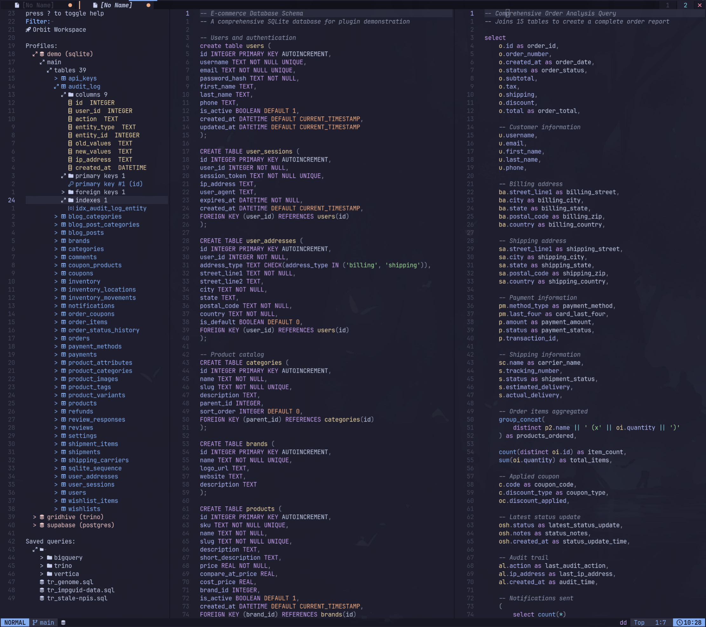

# Quarry.nvim

A native-feeling database workspace for Neovim. Quarry runs statements through your existing database CLI, keeps profiles per query buffer, browses schemas, completes cached objects, and renders JSON results in a navigable grid.



## What It Does

- Open one dedicated workspace tab with a searchable profile and schema browser.
- Run a whole statement or a visual selection asynchronously without leaving Neovim.
- Bind each query buffer to its own connection profile.
- Browse tables, views, and columns; create a bound sample statement; copy qualified object names.
- Inspect and copy raw result values, including structured JSON values.
- Confirm potentially mutating statements before they run.
- Complete cached tables, views, and columns with Neovim's built-in omnifunc.

## Requirements

- Neovim 0.10 or later.
- No required third-party Neovim plugins.
- The CLI required by each connection profile:

| Profile kind | CLI | Notes |
| --- | --- | --- |
| `trino` | [`trino`](https://trino.io/docs/current/client/cli.html) | Quarry requests JSON output. |
| `sqlite` | `sqlite3` | Requires a build that supports `-json`. |

## Installation

With [lazy.nvim](https://github.com/folke/lazy.nvim):

```lua
{
  "mrpbennett/quarry.nvim",
  opts = {},
}
```

Or call setup from your Neovim configuration:

```lua
require("quarry").setup()
```

## Quick Start

1. Run `:QuarryProfiles`. This creates `~/.local/share/quarry.nvim/profiles.json` with owner-only (`0600`) permissions and opens it for editing.
2. Add a connection profile using the format below.
3. Open `:QuarryWorkspace` or a SQL buffer.
4. Bind a profile with `:QuarryProfile`, or press `<CR>` on a profile in the workspace.
5. Run `:QuarryExecute`, or use `<leader>E` in Normal or Visual mode in a SQL buffer.

If a query buffer has no profile, executing it opens profile selection and retries after you choose one.

## Connection Profiles

The profile file is the source of truth for named connection profiles. Its default location is `~/.local/share/quarry.nvim/profiles.json`; set `profile_path` in `setup()` to use another location. Quarry refuses to load a file that is not mode `0600`.

Profiles are JSON, versioned at `1`, and names must be unique:

```json
{
  "version": 1,
  "profiles": [
    {
      "name": "analytics",
      "kind": "trino",
      "options": {
        "server": "https://trino.example.com:8443",
        "user": "alice",
        "catalog": "hive",
        "schema": "analytics",
        "arguments": ["--password"]
      }
    },
    {
      "name": "local",
      "kind": "sqlite",
      "options": {
        "path": "/home/alice/data.db"
      }
    }
  ]
}
```

### Supported Connectors

| Kind | Required options | Optional options | Schema support |
| --- | --- | --- | --- |
| `trino` | `server`, `user`, `catalog` | `schema`, `executable`, `arguments`, `confirm_mutations` | Tables, views, and columns from `information_schema`. Omitting `schema` browses the catalog except `information_schema`. |
| `sqlite` | `path` | `executable`, `arguments`, `confirm_mutations` | Tables and views from `sqlite_master`, plus columns from `PRAGMA table_info`, under `main`. |

`executable` replaces the CLI binary and `arguments` adds an array of string arguments before Quarry's generated arguments. This is useful for wrappers or CLI-specific authentication flags. Quarry starts a fresh CLI process for every statement and schema request; it does not retain a Trino session between commands.

### Trino Authentication

Quarry never stores a password in the profile file. Configure authentication exactly as you do for the Trino CLI, including its `--password` flag, environment variables, tokens, keyrings, or credential providers it uses.

Quarry passes profile values to the CLI as literal arguments. It does **not** expand `$VAR` or `${VAR}` inside JSON. Other Trino CLI authentication mechanisms, such as tokens or external credential providers, continue to work through their normal CLI configuration.

> [!NOTE]
> Connection profiles can contain sensitive settings. Keep the profile file private and prefer external CLI authentication or environment-based secrets over storing credentials in JSON.

## Workspace Workflow

`:QuarryWorkspace` opens a dedicated Quarry tabpage with a profile/schema sidebar and a normal SQL editing window. Run it again to focus the existing workspace. `:QuarryWorkspaceClose` closes only that tabpage.

1. Press `<CR>` on a profile to select it and bind it to the active query buffer.
2. Optionally press `l` to load its schema for browsing and completion.
3. Press `n` to open a new SQL buffer already bound to the selected profile.
4. Execute a statement. Results appear in the reusable bottom result grid.

Set `saved_query_dir` to add a recursive tree of `.sql` files to the sidebar. Select a profile, then press `<CR>` on a saved query to open it in the Workspace query window bound to that profile; loading the schema is not required. Press `r` on the saved-query directory to rescan it.

From a workspace query buffer, `/` focuses the workspace filter. Elsewhere, `/` retains normal Neovim search behavior.

## Commands

| Command | Description |
| --- | --- |
| `:QuarryProfiles` | Create, protect, and edit the profile file. |
| `:QuarryProfile` | Search profiles and bind one to the current query buffer. |
| `:QuarrySelectProfile` | Alias for `:QuarryProfile`. |
| `:QuarryExecute` | Execute the single unambiguous statement in the current buffer. |
| `:'<,'>QuarryExecute` | Execute the selected line range. |
| `:QuarryCancel` | Cancel the statement running in the current buffer. |
| `:QuarryBrowse [profile]` | Open the standalone schema browser for a profile or the buffer's profile. |
| `:QuarryBrowse! [profile]` | Open the schema browser and focus its filter. In a workspace, focus the workspace filter. |
| `:QuarryWorkspace` | Open or focus the Quarry workspace. |
| `:QuarryWorkspaceClose` | Close the Quarry workspace tabpage. |

Whole-buffer execution rejects ambiguous multi-statement content. Select the exact statement in Visual mode, then run `:QuarryExecute` or `<leader>E`.

## Keybindings

### Configurable Mappings

Quarry installs the following defaults:

| Mode and scope | Mapping | Action |
| --- | --- | --- |
| Normal, global | `<leader>D` | Open the workspace. |
| Normal, SQL buffer | `<leader>E` | Execute the buffer statement. |
| Visual, SQL buffer | `<leader>E` | Execute the visual selection. |
| Normal, SQL buffer | `<leader>P` | Select a connection profile. |
| Normal, SQL buffer | `<leader>B` | Open the schema browser. |
| Normal, SQL buffer | `<leader>X` | Cancel the running statement. |

Configure action mappings through `keymaps`. `execute`, `browse`, `cancel`, and `select_profile` are buffer-local in SQL buffers; `workspace` is global. Set an action to `false` to disable its default mapping.

```lua
require("quarry").setup({
  keymaps = {
    execute = "<leader>E",
    workspace = "<leader>D",
    select_profile = "<leader>P",
    browse = "<leader>B",
    cancel = "<leader>X",
  },
})
```

### Workspace Sidebar

| Key | Action |
| --- | --- |
| `l` | Expand the selected profile, schema, object group, or object. |
| `h` | Collapse the selected node. |
| `<CR>` | Select and bind a profile to the current query buffer, or open a saved query bound to the selected profile. |
| `n` | Create a query buffer bound to the selected profile. |
| `/` | Filter profiles, schema objects, and saved queries. |
| `r` | Reload the profile file and refresh the selected profile schema, or rescan saved queries. |
| `?` | Show help. |
| `q` | Close the workspace. |

### Standalone Schema Browser

| Key | Action |
| --- | --- |
| `l` or `<CR>` | Expand an object's columns. |
| `h` | Collapse an object's columns. |
| `s` | Open a bound `SELECT * ... LIMIT ...` sample statement. |
| `y` | Copy the object name. Trino names include catalog and schema. |
| `/` | Filter objects. |
| `r` | Reload the profile and schema. |
| `?` | Show help. |
| `q` | Close the browser. |

### Result Grid

| Key | Action |
| --- | --- |
| `h`, `j`, `k`, `l` | Move between cells. |
| `<CR>` | Inspect the raw value in a floating window. |
| `y` | Copy the raw selected value. |
| `q` | Close the standalone grid, or return to the query editor in a workspace. |

Normal Neovim scrolling remains available, including `<C-d>`, `<C-u>`, `zh`, and `zl`.

## Completion

Binding a connection profile attaches Quarry's native omnifunc to the query buffer. Use `<C-x><C-o>` in Insert mode for cached schema objects:

- Tables and views after `FROM`, `JOIN`, `UPDATE`, or `INTO`.
- Trino tables and views after `schema.`.
- Cached columns after `table.`.

Selecting a profile preloads tables and views in the background; opening the schema browser fills more of the cache. Completion never runs the CLI while you type. SQL keywords, CTE aliases, formatting, and highlighting remain the responsibility of your existing SQL tooling.

## Execution And Results

Quarry runs each statement asynchronously through a fresh invocation of the selected profile's CLI. Failures notify you and open a diagnostic window. One running statement is allowed per query buffer; `:QuarryCancel` sends a termination signal to that CLI process.

Potentially mutating statements require confirmation by default. A single `SELECT`, `SHOW`, `DESCRIBE`, `EXPLAIN`, `USE`, or `VALUES` statement runs without confirmation; everything else requires it. This is a convenience guardrail, not a security boundary.

Result grids are reused per tabpage. They show up to `result_limit` rows and truncate displayed cell text to `max_cell_width` characters while retaining the raw value for copy and inspection.

## Configuration

```lua
require("quarry").setup({
  confirm_mutations = true,
  focus_results = false,
  profile_path = vim.fn.expand("~/.local/share/quarry.nvim/profiles.json"),
  result_limit = 200,
  result_height = 15,
  saved_query_dir = vim.fn.expand("~/queries"),
  max_cell_width = 48,
  schema_width = 36,
  workspace_sidebar_width = 32,
  workspace_result_ratio = 0.30,
  winbar = false,
})
```

| Option | Default | Description |
| --- | --- | --- |
| `confirm_mutations` | `true` | Ask before statements that are not recognised as read-only. A profile can override this with `options.confirm_mutations`. |
| `focus_results` | `false` | Focus a completed standalone result grid instead of keeping focus in the query buffer. |
| `profile_path` | `~/.local/share/quarry.nvim/profiles.json` | Location of the profile file. |
| `result_limit` | `200` | Maximum returned rows displayed in the result grid. |
| `result_height` | `15` | Height of a standalone result grid. |
| `saved_query_dir` | `nil` | Directory of recursively discovered `.sql` files shown in the Workspace sidebar. |
| `max_cell_width` | `48` | Maximum displayed width of a result cell. |
| `schema_width` | `36` | Width of the standalone schema browser. |
| `workspace_sidebar_width` | `32` | Width of the workspace sidebar. |
| `workspace_result_ratio` | `0.30` | Fraction of editor height used by workspace results, with a six-line minimum. |
| `winbar` | `false` | Show Quarry status in SQL-window winbars. |
| `keymaps` | See above | Configurable action mappings. |
| `icons` | Nerd Font glyphs | Override `collapsed`, `expanded`, `folder`, `profile`, `query`, `result`, `saved_query`, `table`, `view`, `column`, and `workspace`. |

For a custom statusline, call `require("quarry").status()`. It reports the bound profile and shows elapsed time while a statement is running.

```lua
require("quarry").setup({
  winbar = true,
  icons = {
    collapsed = ">",
    expanded = "v",
    profile = "@",
    table = "#",
    view = "~",
  },
})
```

## Current Scope

Quarry currently supports only the Trino and SQLite CLI connectors described above. Adding an arbitrary database client or driver is not configured through a profile; unsupported profile kinds and unknown connector options are rejected. Use the database's CLI authentication and configuration mechanisms, then point a supported connection profile at it.
# quarry.nvim
